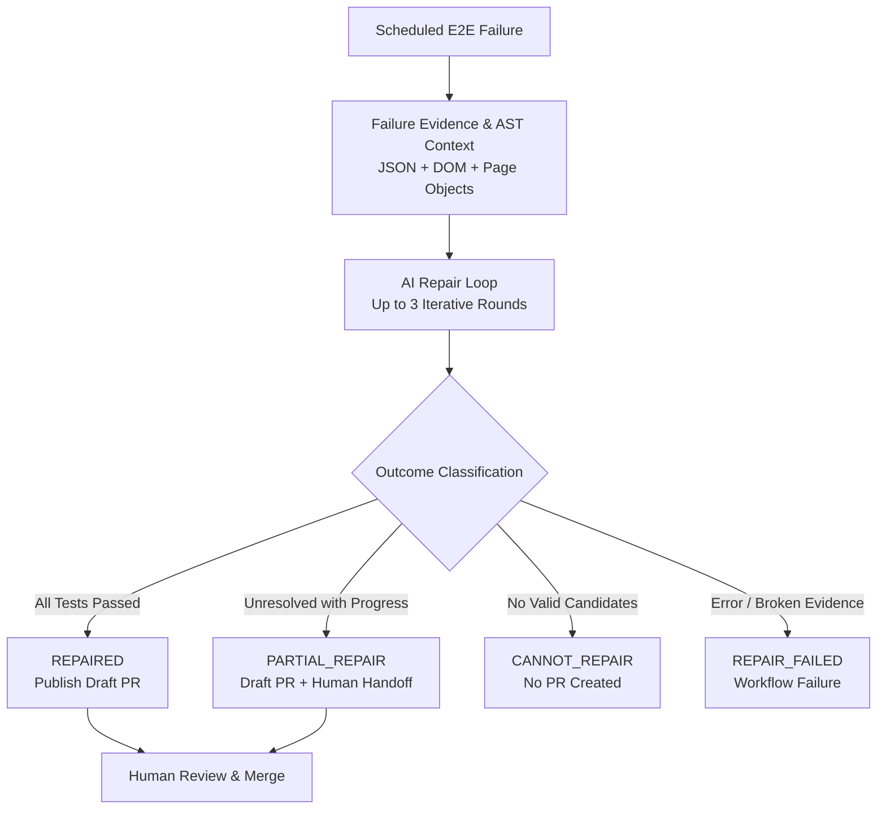

# AI-Assisted Self-Healing Playwright E2E Suite

[繁體中文](README.zh-TW.md) | English

An automated, AI-assisted Playwright E2E test maintenance system that detects UI locator drift during scheduled CI runs, proposes scoped Page Object repairs, validates them through full regression testing, and opens a Draft PR for human review.

---

## What Problem Does This Solve?

UI end-to-end test suites frequently break due to harmless frontend changes—renamed button labels, modified accessible roles, or updated test attributes (locator drift).

Traditionally, an engineer must:
1. Inspect the CI failure logs and screenshots
2. Inspect the current page DOM
3. Locate the corresponding Page Object
4. Update the locator
5. Run local and regression tests
6. Create a Pull Request

This repository automates that maintenance loop while keeping engineers firmly in control through automated regression verification and human-in-the-loop Draft PR reviews. **AI proposes repairs, deterministic code validates safety, full E2E verifies correctness, and humans review and merge.**

---

## Architecture Flow



> **Summary**: When scheduled E2E tests fail, failure evidence and AST-discovered Page Objects are gathered into diagnosis context. The system runs an iterative AI repair loop (up to 3 rounds with fresh evidence), classifies the outcome, and publishes a Draft PR when safe repairs are available for human review.

---

## Key Design Decisions

### 1. Dual Page Object Discovery (AST + Traceback)
Locator drift often causes assertions to fail in the test file rather than inside a Page Object method. If diagnosis context only examined traceback frames, Page Objects used later in the test flow would be missing.

The discovery engine unions two sources:
- **Traceback frames**: Page Objects directly involved in the exception.
- **AST imports**: All `pages.*` modules directly imported by the failing test file.

This ensures multi-step flows (e.g., Round 1 repairs Login, Round 2 encounters an assertion failure on Cart) have full Page Object context available.

### 2. Partial Repair as Human Handoff
`PARTIAL_REPAIR` is an intentional human-in-the-loop feature, not a failure.

When AI successfully repairs initial locator failures (e.g., login button) but encounters a complex or non-locator issue downstream, the system does **not** roll back valid work. Instead, it creates a Partial Draft PR preserving the safe, verified progress, allowing the engineer to continue from an advanced state rather than debugging from scratch.

### 3. Iterative Multi-Round Repair
Failure cascades are common in E2E tests: fixing an early step reveals downstream changes. The system runs up to **3 iterative rounds**, capturing fresh DOM and failure evidence after each round's regression run.

---

## Mechanical Safety Boundaries

AI is treated as an untrusted proposal engine. Multiple deterministic gates enforce repository safety:

- **Strict File Scope**: Repairs are strictly confined to `pages/**/*.py`. Modifications to `tests/**`, configuration, or CI files are immediately rejected.
- **Exact Literal Replacement**: Every candidate must match an exact, unique substring in the target file.
- **Checked-Out Commit Pinning**: The self-heal workflow checks out the exact commit SHA that failed in the scheduled monitor.
- **Static Quality Checks**: Patches must pass `ruff check`, `ruff format --check`, `git diff --check`, and produce zero untracked files.
- **Full Containerized Regression**: Every repair must be verified by a clean `docker compose run` serial E2E run.
- **Least-Privilege CI Permissions**: The self-heal workflow runs with read-only permissions; PR creation credentials are scoped exclusively to the final publication step.
- **No Automatic Merging**: All repairs are submitted as **Draft PRs** requiring human review and approval.

---

## Project Structure

```text
├── .github/
│   └── workflows/
│       ├── ci.yml                 # PR & push regression check
│       ├── nightly.yml            # Scheduled E2E monitor
│       └── self-heal.yml          # Automated self-healing & Draft PR workflow
├── ai/
│   ├── agent-instructions/        # Specialized AI instructions
│   └── prompts/
│       └── locator-repair.md      # Structured repair prompt template
├── pages/                         # Page Object Models (repair scope)
│   ├── authentication/
│   ├── cart/
│   ├── checkout/
│   └── inventory/
├── scripts/
│   └── self-heal/
│       ├── check-duplicate-pr.sh  # Cross-run fingerprint deduplication
│       └── publish-draft-pr.sh    # Draft PR publisher with human review checklist
├── self_heal/                     # Core self-healing engine
│   ├── __init__.py                # SelfHealError definition
│   ├── agent.py                   # AI prompt assembly & Gemini structured repair
│   ├── evidence.py                # Failure context & AST Page Object discovery
│   └── safety.py                  # Candidate validation & mechanical safety checks
├── tests/                         # Playwright E2E test suite
├── tools/
│   └── self_heal.py               # Repair loop CLI entry point
├── Dockerfile
├── compose.yaml
├── config.py
└── requirements.txt
```

---

## Tech Stack

- **Testing**: Python 3.14, Playwright, pytest, pytest-playwright, pytest-xdist
- **AI / Self-Healing**: Google GenAI SDK (Gemini, configurable via `SELF_HEAL_MODEL`), Pydantic v2
- **Code Quality**: Ruff
- **Container & CI**: Docker Compose, GitHub Actions

---

## Local Setup & Execution

### Prerequisites & Setup

```bash
python3.14 -m venv .venv
source .venv/bin/activate
cp .env.example .env
python -m pip install --upgrade pip
python -m pip install -r requirements.txt -r requirements-self-heal.txt
python -m playwright install chromium
```

Configure `SAUCEDEMO_USERNAME`, `SAUCEDEMO_PASSWORD`, and `GEMINI_API_KEY` in `.env`.

### Running Tests Locally

```bash
# Static checks
ruff check .
ruff format --check .

# Serial execution (default)
pytest --browser chromium

# Parallel execution (2 workers)
pytest --browser chromium -n 2
```

### Reproducible Container Execution

```bash
# Build test container
docker compose build tests

# Run full E2E suite in container
docker compose run --rm tests
```

### Running Self-Heal Locally

```bash
# Run self-heal repair loop on captured failure evidence
python -m tools.self_heal --evidence test-results/self-heal
```

---

## Roadmap

- [x] **Phase 1** — Framework + Login happy path baseline
- [x] **Phase 2** — Core E2E scenarios (cart, inventory, multi-step checkout)
- [x] **Phase 3** — Parallel execution with worker session isolation (`pytest-xdist`)
- [x] **Phase 4** — Docker containerization & CI hardening
- [x] **Phase 5** — AI-assisted locator repair (Gemini diagnosis + structured output)
- [x] **Phase 6** — Iterative Multi-Failure Self-Healing & Draft PR Automation
  - Cross-run fingerprint deduplication (`scripts/self-heal/check-duplicate-pr.sh`)
  - AST-based Page Object discovery for assertion failures
  - Multi-round iterative repair loop with fresh evidence
  - Safe partial repair human handoff mechanism
