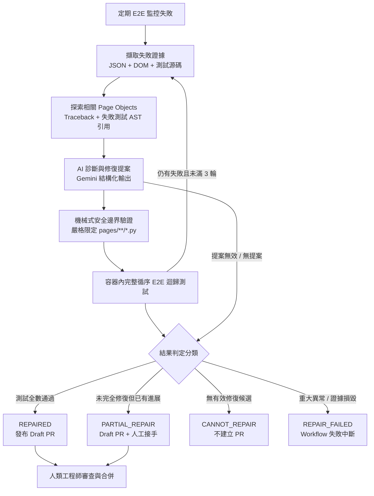

# AI 輔助自我修復 Playwright E2E 測試維護系統

繁體中文 | [English](README.md)

一套自動化、AI 輔助的 Playwright E2E 測試維護系統。能在定期 CI 監控失敗時自動偵測 UI locator drift，提出受限於 Page Object 的修復候選，透過完整容器化迴歸測試驗證，並建立供工程師審查的 Draft PR。

---

## 解決什麼問題？

UI 端到端（E2E）自動化測試常因前端非破壞性變更（按鈕文字修改、accessible role 調整、測試屬性變動等 locator drift）而中斷。

傳統維護流程中，工程師必須：
1. 檢視 CI 失敗紀錄與截圖
2. 檢查目前頁面的 DOM 結構
3. 找出對應的 Page Object 檔案
4. 更新 locator
5. 於本機與 CI 執行完整迴歸測試
6. 發起 Pull Request

本專案將這段日常維護流程自動化，同時透過全自動迴歸驗證與 Draft PR 人工審查機制，確保工程師擁有最終決策權。**AI 提出修復候選、程式碼限制安全邊界、完整 E2E 驗證正確性、人類工程師審查與合併。**

---

## 架構流程



> **摘要**：當定期 E2E 測試失敗時，系統彙整失敗證據與透過 AST 探索出的 Page Object 作為診斷上下文；AI 提出最小 locator 修復候選，經由機械式安全邊界驗證後，於 Docker 容器內執行完整循序迴歸測試（最多以最新證據迭代 3 輪），最終判定結果分類並發布 Draft PR 供工程師審查。

---

## 關鍵架構決策

### 1. 雙重 Page Object 探索機制（AST + Traceback）
Locator drift 經常導致 assertion 在測試檔案本體失敗，而非在 Page Object 方法內部拋出例外。若診斷上下文僅分析 traceback，後續流程所需的 Page Object 將無法被納入。

本系統的探索引擎聯集兩大來源：
- **Traceback 呼叫堆疊**：直接出現在例外路徑中的 Page Object。
- **AST 語法樹解析**：失敗測試檔案中直接 import 的所有 `pages.*` 模組。

這確保了多步驟測試（例如第 1 輪修復 Login，第 2 輪在 Cart 發生 assertion failure）在各輪次皆具備完整的 Page Object 上下文。

### 2. 局部修復作為安全的人機協作接力（Human Handoff）
`PARTIAL_REPAIR` 是刻意設計的人機協作機制，並非單純的失敗。

當 AI 成功修復前段 locator（例如登入按鈕），但後續步驟遇到複雜或非 locator 問題時，系統**不會**回滾已驗證的安全進展。相反地，它會建立標註 Partial 的 Draft PR，保存已驗證的修改，讓工程師能直接從最新狀態接手，無需從頭除錯。

### 3. 多輪次迭代修復機制
E2E 測試常有連鎖依賴：修復前置步驟後才會顯露後續步驟的變更。系統最多執行 **3 輪迭代修復**，每輪迴歸後皆以最新的 DOM 與失敗證據重新診斷。

---

## 機械式安全邊界

AI 被視為不受信任的提案引擎。系統透過多道確定性關卡確保 repository 安全：

- **嚴格檔案範圍**：修復範圍嚴格限制於 `pages/**/*.py`。任何針對 `tests/**`、設定檔或 CI 流程的修改一律拒絕。
- **精確字串比對**：每個修復候選必須在目標檔案中精確、唯一匹配一段字串，禁止任意覆寫整檔。
- **鎖定失敗當下 Commit**：自我修復 workflow 嚴格 checkout 定期監控失敗時的 exact commit SHA。
- **靜態品質檢查**：修復後必須通過 `ruff check`、`ruff format --check`、`git diff --check`，且不可產生任何 untracked 檔案。
- **容器化完整迴歸**：每次修復必須經由純淨的 `docker compose run` 循序 E2E 測試驗證。
- **最小權限 CI 設計**：自我修復 workflow 採用 GitHub Actions 內建的 `GITHUB_TOKEN`，並遵循最小權限原則（`contents: write`、`pull-requests: write`、`actions: read`），完全無需設定個人存取權杖（PAT）或額外的 GitHub App。
- **永不自動合併且需人工審查**：所有修復皆以 **Draft PR** 形式提出，必須由人類工程師進行 Review 與 Approval。自我修復流程在建立 Draft PR 之前已完成靜態檢查與完整 E2E 迴歸驗證。由於 PR 是透過 GitHub Actions 的 repository token 建立，GitHub 可能需要維護者手動核准（approve）才會觸發 PR CI 流程。

---

## 專案結構

```text
├── .github/
│   └── workflows/
│       ├── ci.yml                 # PR 與 push 迴歸檢查
│       ├── nightly.yml            # 定期 E2E 監控
│       └── self-heal.yml          # 自動自我修復與 Draft PR workflow
├── ai/
│   ├── agent-instructions/        # 專屬 AI instructions
│   └── prompts/
│       └── locator-repair.md      # 結構化修復 Prompt 範本
├── pages/                         # Page Object Models（修復目標範圍）
│   ├── authentication/
│   ├── cart/
│   ├── checkout/
│   └── inventory/
├── scripts/
│   └── self-heal/
│       ├── check-duplicate-pr.sh  # 跨 run 指紋去重複機制
│       └── publish-draft-pr.sh    # Draft PR 發布腳本與檢核清單
├── self_heal/                     # 自我修復核心引擎
│   ├── __init__.py                # SelfHealError 定義
│   ├── agent.py                   # AI Prompt 組裝與 Gemini 結構化修復
│   ├── evidence.py                # 失敗上下文與 AST Page Object 探索
│   └── safety.py                  # 候選驗證與機械式安全檢查
├── tests/                         # Playwright E2E 測試套件
├── tools/
│   └── self_heal.py               # 修復迴圈 CLI 進入點
├── Dockerfile
├── compose.yaml
├── config.py
└── requirements.txt
```

---

## 技術棧

- **測試框架**：Python 3.14, Playwright, pytest, pytest-playwright, pytest-xdist
- **AI / 自我修復**：Google GenAI SDK (Gemini，可透過 `SELF_HEAL_MODEL` 設定), Pydantic v2
- **程式碼品質**：Ruff
- **容器與 CI**：Docker Compose, GitHub Actions

---

## 設定與執行

### 環境建置與本機設定

```bash
python3.14 -m venv .venv
source .venv/bin/activate
cp .env.example .env
python -m pip install --upgrade pip
python -m pip install -r requirements.txt -r requirements-self-heal.txt
python -m playwright install chromium
```

於 `.env` 中設定 `SAUCEDEMO_USERNAME`、`SAUCEDEMO_PASSWORD` 與 `GEMINI_API_KEY`。

### GitHub Actions 設定

若要在 GitHub Actions 中啟用自動自我修復：
- **Repository Secrets**：設定 `SAUCEDEMO_USERNAME`、`SAUCEDEMO_PASSWORD` 與 `GEMINI_API_KEY`。
- **Workflow 權限設定**：至 **Settings → Actions → General → Workflow permissions**：
  - 選擇 **"Read and write permissions"**（或由 workflow 宣告最小權限）。
  - 確認勾選 **"Allow GitHub Actions to create and approve pull requests"**。
- 無需設定任何個人存取權杖（PAT）或 GitHub App，workflow 會直接使用 GitHub Actions runtime 提供的內建 `GITHUB_TOKEN`。

### 執行測試

```bash
# 靜態品質檢查
ruff check .
ruff format --check .

# 循序執行（預設）
pytest --browser chromium

# 平行執行（2 workers）
pytest --browser chromium -n 2
```

### 容器化執行

```bash
# 建置測試容器映像檔
docker compose build tests

# 於容器內執行完整 E2E 測試
docker compose run --rm tests
```

### 本機執行自我修復

```bash
# 針對現有的失敗證據執行自我修復迴圈
python -m tools.self_heal --evidence test-results/self-heal
```

---

## 發展歷程（Roadmap）

- [x] **Phase 1** — 測試框架基礎與登入 Happy Path
- [x] **Phase 2** — 核心 E2E 商業情境（購物車、商品清單、多步驟結帳）
- [x] **Phase 3** — Session 隔離的多 Worker 平行測試（`pytest-xdist`）
- [x] **Phase 4** — Docker 容器化與 CI 供應鏈安全強化
- [x] **Phase 5** — AI 輔助 Locator 修復（Gemini 診斷與結構化輸出）
- [x] **Phase 6** — 多失敗迭代自我修復與 Draft PR 自動化
  - 跨 Run 指紋去重複機制（`scripts/self-heal/check-duplicate-pr.sh`）
  - 針對 Assertion Failure 的 AST Page Object 探索
  - 基於最新執行證據的多輪次迭代修復迴圈
  - 安全局部修復的人機協作接力機制
